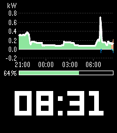
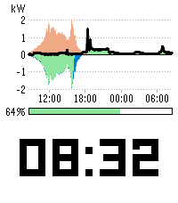
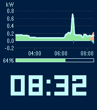
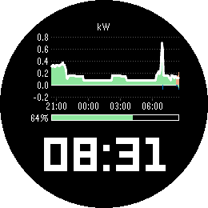
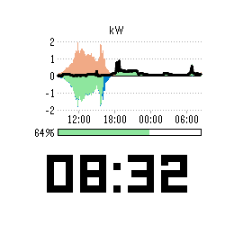
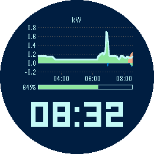

# Power Sources

*Your Home Assistant energy dashboard, on your wrist.*

     

A Pebble watchface (v1.0.0).

Power Sources puts the power sources graph from the Home Assistant energy
dashboard on your watch, right above the time. At a glance you see where
your power has been coming from: solar, battery and grid, stacked the same
way Home Assistant stacks them.

Above the zero line is what feeds the house - solar in orange, battery
discharge in green, grid import in blue. Below it is where surplus goes -
battery charging and grid export. A line on top traces your total
consumption, just like the "Now" view in Home Assistant.

There is nothing to map. Power Sources reads your energy dashboard
configuration and uses the power sensors you set up there for your solar,
battery and grid sources. Two batteries or several solar arrays are summed
per type, exactly as in Home Assistant. Give it the address of your Home
Assistant and an access token, and the graph appears.

If your batteries have a state of charge sensor in the energy dashboard, a
bar between graph and time shows how full they are, from 0 to 100 percent.
With several batteries it shows the combined level, weighted by the usable
capacity you entered for each, just as Home Assistant does. Without a state
of charge sensor the bar simply stays away and the graph takes its place.

The graph always ends at the current time and reaches back 3, 6, 12 or 24
hours - your choice. Axis labels show kilowatts and the time of day, and the
scale adapts to your values. It refreshes every five minutes, in step with
the five minute statistics Home Assistant keeps. Only new data is loaded
after the first fetch, so the phone does not pull the whole day every time.

The time sits in the lower 40 percent of the display in the built-in LECO
numerals, large enough to read without thinking about it.

Two colour schemes, one for the day and one for the night, each with its
own background and text colour. Night mode switches between them at the
times you choose - a dark face during the day and a light one at night, or
the other way round, or any colours you like.

Your access token stays on the phone. It is never sent to the watch.

Made for Pebble Time 2 and Pebble Round 2, each with its own layout.

Requirements: Home Assistant with the energy dashboard set up, and power
sensors entered for your sources (Settings > Dashboards > Energy, the power
field of each solar, battery and grid source). For the charge bar, add the
state of charge sensor and, with several batteries, the usable capacity to
each battery source. Your phone needs to reach
your Home Assistant, at home or through remote access.

## Settings

- URL - the address of your Home Assistant, for example
  https://ha.example.org or http://192.168.1.10:8123.
- Long-lived access token - created in Home Assistant under your profile,
  Security tab. Stays on the phone.
- Time span - how far back the graph reaches: 3, 6, 12 or 24 hours.
- Day colours - background, and the colour of the time, axes and
  consumption line.
- Use night colours - switches to the night colours between the two times
  below.
- Night begins / Day begins - any time of day.
- Night colours - background, and the colour of the time, axes and
  consumption line at night.

12 or 24 hour format follows the watch setting.

## Platforms

- Pebble Time 2 (`emery`)
- Pebble Round 2 (`gabbro`)

## Building

With the [Pebble SDK](https://developer.repebble.com/sdk/):

```bash
pebble build
pebble install --emulator emery
```

The repository can also be imported into CloudPebble as is.

## Release notes

### 1.0.0

First release.
